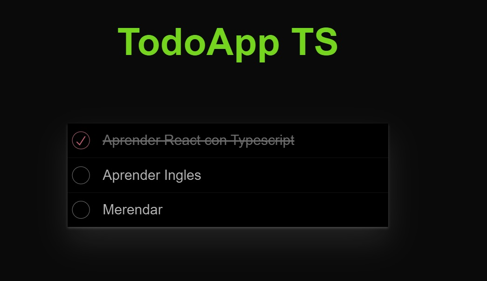

# Todo-App-TS

Esta es una aplicación de lista de tareas (todo list) creada con React.js. La aplicación permite a los usuarios agregar, editar, eliminar y marcar tareas como completadas. Está diseñada para ser sencilla y fácil de usar, proporcionando una experiencia de usuario fluida.

## Características

- __Agregar Tareas:__ Los usuarios pueden agregar nuevas tareas a la lista.
- __Editar Tareas:__ Las tareas existentes pueden ser editadas.
- __Eliminar Tareas:__ Los usuarios pueden eliminar tareas que ya no son necesarias.
- __Marcar como Completadas:__ Las tareas pueden ser marcadas como completadas.
- __Persistencia:__ Las tareas se guardan en el almacenamiento local del navegador para que no se pierdan al cerrar la aplicación.
- __Interfaz Intuitiva:__ Una interfaz de usuario clara y fácil de usar.

## Tecnologías Utilizadas

- React.js
- Typescript
- Html
- Css

## Uso

- Agregar Tarea: Ingresa una nueva tarea en el campo de texto y presiona el botón "Agregar".

- Editar Tarea: Haz clic en el icono de edición junto a la tarea que deseas modificar, realiza los cambios y guarda.

- Eliminar Tarea: Haz clic en el icono de eliminar junto a la tarea que deseas borrar.

- Marcar como Completada: Haz clic en la casilla de verificación junto a la tarea para marcarla como completada.

## Requerimientos

 - Inicializar proyecto con Vite
 - Añadir linter para TypeScript + React
 - Añadir estilos del TodoMVC
 - Listar todos los TODOs
 - Poder borrar un TODO
 - Marcar TODO como completado
 - Añadir forma de filtrar TODOs (Footer)
 - Mostrar número de TODOs pendientes (Footer)
 - Añadir forma de borrar todos los TODOs completados
 - Crear Header con input (Header)
 - Crear un TODO (Header)
 - Poder editar el texto de un TODO (Doble click)
 - Añadir animaciones con AutoAnimate
 - Pasar a Reducer
 - Sincronizar con el backend

